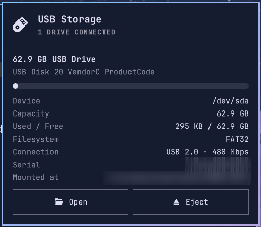

# USB Storage for Omarchy

A bar widget for the [Omarchy](https://omarchy.org) shell that shows plugged-in USB drives. The icon only appears while a drive is connected; click it for details and a safe-eject button.



## Features

- Appears and disappears automatically as drives are plugged in and removed (udev hotplug)
- Per-drive label, vendor/model, capacity, used/free with a usage bar, filesystem, serial and mount point
- Negotiated USB link speed, with a warning when a USB 3 drive has fallen back to USB 2 speed
- **Open** the drive in your file manager, or **Eject** it: unmounts every partition and powers the drive off, then notifies you when it's safe to remove
- Keyboard navigable, follows your Omarchy theme

## Install

```bash
omarchy plugin add https://github.com/HakataMike/omarchy-usb-storage.git --enable
```

Or from the Omarchy menu: **Setup → Plugins → Add Plugin**.

Update later with `omarchy plugin update hakatamike.usb-storage`, remove with `omarchy plugin remove hakatamike.usb-storage`.

## Requirements

Built for the Omarchy 4 shell. Everything it uses ships with Omarchy:

- `udisks2` (unmount and power-off without root)
- `util-linux` (`lsblk`), `jq`, `systemd` (`udevadm`)
- `libnotify` (`notify-send`), `xdg-utils` (`xdg-open`)
- Optional: `udiskie` or similar for automounting, so the Open button and usage figures are available

## How it works

`Panel.qml` is the widget and popup. It calls the `usb-storage` helper script, which lists USB disks as JSON (`usb-storage list`) and ejects them through udisks (`usb-storage eject /dev/sdX`). `Model.js` holds the formatting logic.

## License

[MIT](LICENSE)
